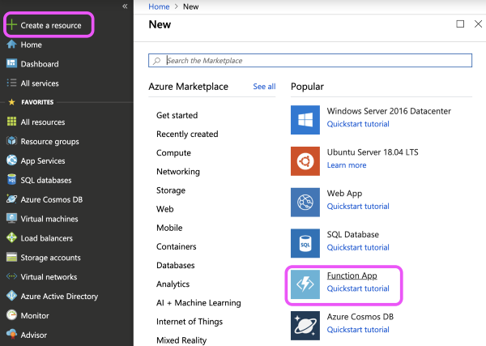
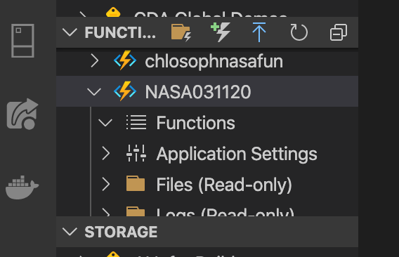
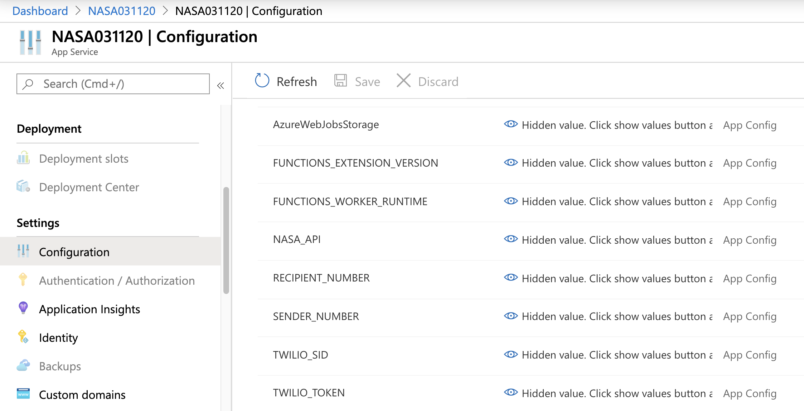
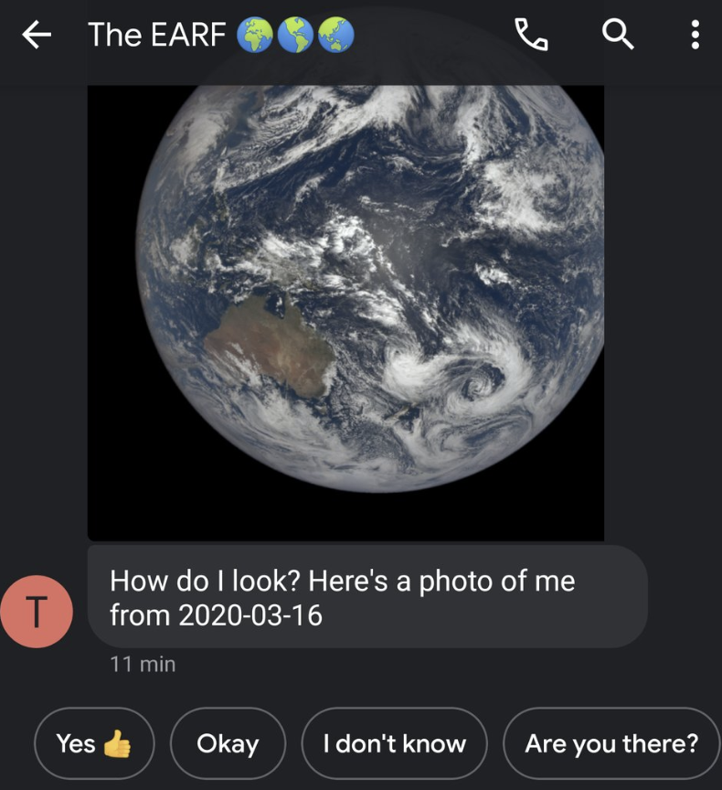

This post ([co-created with Chloe Condon](https://twitter.com/ChloeCondon)) will walk you through how to use [Azure Functions](https://docs.microsoft.com/en-us/learn/modules/create-serverless-logic-with-azure-functions/?WT.mc_id=nasafunctions-devto-chcondon), [VSCode](https://visualstudio.microsoft.com/?WT.mc_id=nasafunctions-devto-chcondon), and [Twilio](www.twilio.com/referral/QYHnll) to create a text thread between you and Earth (well, you and the [NASA EPIC API](https://epic.gsfc.nasa.gov/) 🤳).

While sure, there are many classified things and behind the scenes at NASA that we don't (and may never 👽🤫🛸) get to see, a majority of NASA's research, data, and findings are publicly available for all to use.

Which is how this project was born! I met [Chloe Condon](https://twitter.com/ChloeCondon) at her Bootcamp Office Hours at the SF [Microsoft Reactor](https://developer.microsoft.com/en-us/reactor/). We bonded over our non-traditional backgrounds and shared love of bread (blog post involving this coming VERY soon! 🥖🍞). This project was really fun to create together since I was a complete newbie to [Azure Functions](https://docs.microsoft.com/en-us/azure/azure-functions/?WT.mc_id=nasafunctions-devto-chcondon) before this project! We hope you enjoy this project and getting your sea-legs (er- space-legs? 🤔🚀) with [Twilio](www.twilio.com/referral/xBBj30), [Azure](https://docs.microsoft.com/en-us/azure/azure-functions/?WT.mc_id=nasafunctions-devto-chcondon), and the many many open [NASA APIs](https://api.nasa.gov/) available to you!

We built this using the Azure portal + VSCode and is intended for students and learners new to Azure. You can of course build this however you'd like! These particular steps have been written for those new to our portal + VSCode (with lots of visuals to help you along the way!).

## Let's Get to the Code! 👩🏼‍💻

To follow this tutorial, you’ll need a few things:

## ☁️ An Azure account

[Azure Functions](https://docs.microsoft.com/en-us/learn/modules/create-serverless-logic-with-azure-functions/?WT.mc_id=nasafunctions-devto-chcondon) make it possible to get projects up and running very quickly, without worrying about spinning up a server. We’ll be triggering our function with an [Azure Functions Timer](https://docs.microsoft.com/en-us/azure/azure-functions/functions-create-scheduled-function/?WT.mc_id=nasafunctions-devto-chcondon), but there are many other ways to execute (for other examples, check out other posts on my Dev.to!). If you’ve never worked with Azure before, [this Microsoft Learn tutorial on creating your first function could be helpful](https://docs.microsoft.com/en-us/learn/modules/execute-azure-function-with-triggers/?WT.mc_id=nasafunctions-devto-chcondon), and you can dive into [the docs](https://docs.microsoft.com/en-us/azure/azure-functions/?WT.mc_id=nasafunctions-devto-chcondon) too.

## ☎️: A Twilio account and phone number

Create a [Twilio account](www.twilio.com/referral/QYHnll), and add a trial phone number that can receive SMS _and_ MMS.

This might’ve been obvious, but you’ll also need your cell phone handy for texting/testing your app. 🤳

## 👩🏼‍💻: VSCode

We'll be using [VSCode](https://visualstudio.microsoft.com/?WT.mc_id=nasafunctions-devto-chcondon) in this tutorial and using its [Azure Functions extension](https://marketplace.visualstudio.com/items?itemName=ms-azuretools.vscode-azurefunctions/?WT.mc_id=nasafunctions-devto-chcondon). Never used [VSCode](https://visualstudio.microsoft.com/?WT.mc_id=nasafunctions-devto-chcondon) before? Totally confused by what an extension is? 🤯😰 Don't worry- [we have docs for that](https://code.visualstudio.com/docs/editor/extension-gallery/?WT.mc_id=nasafunctions-devto-chcondon)! Also, check out the [intro video](https://code.visualstudio.com/docs/introvideos/extend/?WT.mc_id=nasafunctions-devto-chcondon).

## 🛰: A NASA API Key

Head over to the [NASA API website](https://api.nasa.gov/) and generate an API key (keep this handy- we'll need it later to communicate with the Earth!).

We'll be using the EPIC API (Earth Polychromatic Imaging Camera) in our example, but you're welcome to use any [NASA API](https://api.nasa.gov/) you'd like!


### Prepare to Launch 🚀

Ok- that was a lot of set-up.


Now that we have all the tools we need, let's get to coding!

#### 1️⃣: Create an Azure Function

For the sake of easy to understand visuals/screenshots I used the [Azure portal](https://portal.azure.com/?WT.mc_id=nasafunctions-devto-chcondon) to create this. You can also use [VS Code](https://docs.microsoft.com/en-us/azure/azure-functions/functions-create-first-function-vs-code/?WT.mc_id=nasafunctions-devto-chcondon), the [Azure CLI](https://docs.microsoft.com/en-us/azure/azure-functions/functions-create-first-azure-function-azure-cli/?WT.mc_id=nasafunctions-devto-chcondon), etc.​ With Azure Functions you are given the the ability to code and test Functions locally on your machine without having to deploy to the cloud every single time you want to test (a huge time saver!).

To create an Azure Function, you can just start from the Get Started menu and select Function App in the [Azure portal](https://portal.azure.com/?WT.mc_id=nasafunctions-devto-chcondon).



Then you’ll need to fill in some basic info about your function here. Including the app name, the Azure subscription you’d like to use, a [resource group](https://docs.microsoft.com/en-us/azure/azure-resource-manager/resource-group-overview/?WT.mc_id=nasafunctions-devto-chcondon) (I’m creating a new one in this case), the Operating System you’d like to use, the [hosting plan](https://docs.microsoft.com/en-us/azure/azure-functions/functions-scale/?WT.mc_id=nasafunctions-devto-chcondon) (I’m using consumption), the location I’d like to use (I’m in California, so West US 2 is usually my default), the runtime stack I’d like to use (I’m using NodeJS in this case), and I have the option to create new [storage](https://docs.microsoft.com/en-us/azure/storage/common/storage-introduction/?WT.mc_id=nasafunctions-devto-chcondon) or use existing. I created a new one in this case.​​

Click though until you reach the **Review & Create** page, and when you're ready click create!

Now it's time to head over to [VSCode](https://code.visualstudio.com/). Never used VSCode before? No problem! [Here's a great video by Rachel Weil](https://channel9.msdn.com/Blogs/raw-tech/Beginners-Guide-to-VS-Code) to get you up and running in 10 minutes!

Once you have a lay of the land, go ahead and add the Azure Functions [VSCode Extension](https://code.visualstudio.com/docs/editor/extension-gallery/?WT.mc_id=nasafunctions-devto-chcondon).

## 2️⃣: Add Your Function to VSCode

Once your function is deployed, head over to VSCode and find your function.



Click the folder icon (as shown above) and create a new file for your project. Then select your language (JavaScript), template (timer trigger), a name for your function (we chose "NASATimerTrigger1"), then enter what time you'd like your timer to go off in the form of a cron expression (we used `0015***` to send our texts in the morning, but you'll want to choose this based on your own preference).

Once you've clicked though all of these options, create and open your VSCode project.

In your `index.js` file, add the following code (don't worry- we'll walk through this in sec!):

```js:title=NASAFunction.js
// Save Twilio keys
const accountSid = process.env.TWILIO_SID
const authToken = process.env.TWILIO_TOKEN
const client = require('twilio')(accountSid, authToken)
// Save NASA API key
const nasaAPI = process.env.NASA_API
const fetch = require('node-fetch')

module.exports = async function(context, myTimer) {
  var timeStamp = new Date().toISOString()

  if (myTimer.isPastDue) {
    context.log('JavaScript is running late!')
  }
  context.log('JavaScript timer trigger function ran!', timeStamp)

  let url = `https://api.nasa.gov/EPIC/api/natural/images?api_key=${nasaAPI}`

  // Set up picture for text message
  const fetchNasa = await fetch(url)
  const response = await fetchNasa.json()
  const data = {
    imageID: await response[0].image,
    date: await response[0].date,
  }

  // Set up date for text message
  const year = new Date(data.date).getFullYear()
  let month = new Date(data.date).getMonth() + 1
  // Format single digit dates to become double digits for compatibility with NASA's image URL
  if (month < 10) {
    month = `0${month}`
  }
  let day = new Date(data.date).getDate()
  if (day < 10) {
    day = `0${day}`
  }
  const currentImageDate = `${year}-${month}-${day}`

  // Set up image URL for text message
  const imgURL = `https://epic.gsfc.nasa.gov/archive/natural/${year}/${month}/${day}/png/${data.imageID}.png`

  // Text message set up
  client.messages
    .create({
      from: process.env.SENDER_NUMBER,
      body: `How do I look? Here's a photo of me from ${currentImageDate}`,
      // 'mediaURL' opens and formats the URL so the image on the receipient's device
      mediaUrl: [`${imgURL}`],
      to: process.env.RECIPIENT_NUMBER,
    })
    .then(message => {
      context.log('Message sent')
      context.res = {
        // status: 200, /* Defaults to 200 */
        body: 'Text successfully sent',
      }
      context.log('JavaScript timer trigger function ran!', timeStamp)
      context.done()
    })
    .catch(err => {
      context.log.error('Twilio Error: ' + err.message + ' -- ' + err.code)
      context.res = {
        status: 500,
        body: `Twilio Error Message: ${err.message}\nTwilio Error code: ${err.code}`,
      }
      context.done()
    })
}
```

You'll notice we have a couple variables here that have not been defined! We want to keep our Twilio credentials, phone numbers, and API keys safe (and secret!)... lucky for us, there's a simple way to do this in Azure using the portal!

## 3️⃣: Configure Your Application Settings

Navigate over to **Configuration** and add the following with their values: TWILIO_TOKEN + TWILIO_SID (these can be found on the main page of your Twilio account), SENDER_NUMBER (your Twilio #), RECIPIENT_NUMBER (your number), and your NASA API key (which can be generated [here](https://api.nasa.gov/)). Once you save these, we'll almost be ready for launch! 🚀



Stuck? You can check out our docs for more details on using the [Azure Key Vault in the portal](https://docs.microsoft.com/en-us/azure/key-vault/quick-create-portal/?WT.mc_id=nasafunctions-devto-chcondon) as well as [through the Azure CLI](https://docs.microsoft.com/en-us/azure/key-vault/quick-create-cli/?WT.mc_id=nasafunctions-devto-chcondon).

## 4️⃣: Install a Couple Additional Things

There are a couple additional things we'll need for our app to work. In your VSCode terminal install Twilio with the following command:

`npm install twilio`

And then install node-fetch with the following:

`npm install node-fetch --save`

## 5️⃣: Deploy from VSCode

We're almost there! As a final step, let's deploy the work we did in VSCode to Azure!


Click the deploy button (as shown above- the blue arrow pointing up). You may get some alerts confirming the difference in version here- click through these (we're just confirming our VSCode version differs from the current version in our Azure portal).

If all goes well, and your deployment was successful, it's time to...

## 5️⃣: Get a Text From Earth!


Now it's time to see our Azure Function in action! Click the **Run** button on your Azure Function in the Azure portal to test things out! Your text should look a lil somethin' like this:



For extra fun, add your Twilio phone # to your contacts, so you know the Earth is hitting up your phone with a selfie each day (errr... is it a selfie if the Earth doesn't have hands so [NASA took it](https://api.nasa.gov/)? 🤔🌎🤳 lol).

## 6️⃣: Enjoy Your Daily Earth Texts!

If your text sent successfully- congrats! You now will have a daily text from Earth (ok, it's _technically_ the NASA API, but we can pretend!).

You can find the GitHub repository for this project [here](https://github.com/sophi-li/earth-is-melting).

As always- please reach out with any questions in the comments below ⤵️- Chloe and I are here to help! We look forward to hearing about all the amazing things you build with the NASA API + Azure Functions, and hope you enjoy the daily pics of our beautiful planet ♥️🌎.


