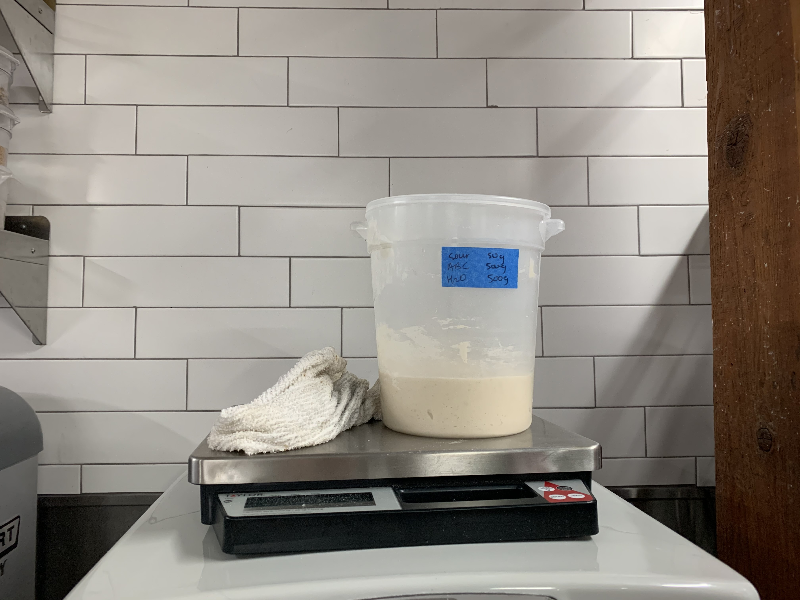
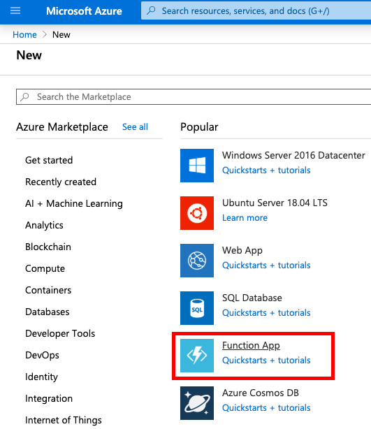
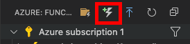
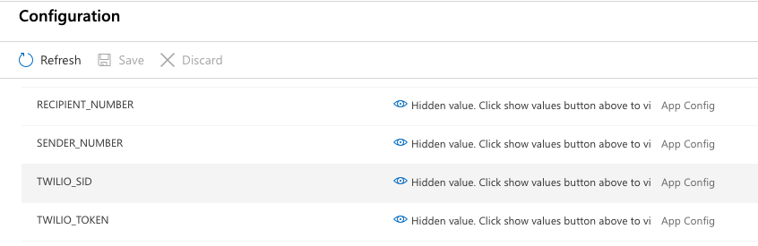
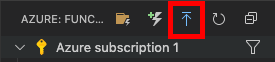
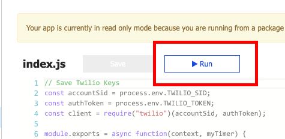
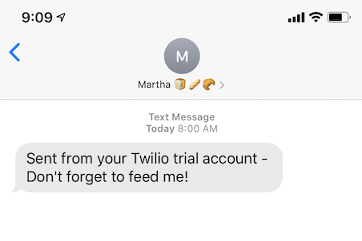

_This post was co-created with [Chloe Condon](https://twitter.com/ChloeCondon), Senior Cloud Advocate at Microsoft, organizer of [Bootcamp Office Hours](https://www.meetup.com/Microsoft-Reactor-San-Francisco/events/266409983/) and host of the [BCC: All](https://www.youtube.com/watch?v=SDMgMo977G0) podcast 🎀. Check out her post [here](https://dev.to/azure/let-s-get-this-bread-using-azure-functions-to-make-sourdough-if2)._

As a [self-taught developer](https://github.com/sophi-li/OKRs-self-learning), I've built a bunch of [projects](https://github.com/sophi-li/), but the best are the ones that solve real problems. A real problem that I and many others have faced, is forgetting to feed our babies. Don't worry, not actual babies, but _sourdough starter babies_! With shelter in place and physical distancing measures to lower the curve, we have a lot less toilet paper and staples like bread in the stores, and a lot more time at home. Consequently, this has resulted in a _rise_ of sourdough baking, and the key to making sourdough bread is starter.

Starter is live wild yeast used to make sourdough bread. You can make it in your own home with a few ingredients and some time! Making starter is a week-long process that involves a chemical reaction between the combination of flour, water, and air. On the first day, you mix flour and water in a jar and let it sit out with the lid slightly ajar. After 24 hours, on day two, you discard about 95% of your original starter, and replace it with a mix of equal parts water and flour. You repeat this process for an entire week, and at the end of the week, you'll have a bubbly and active starter ready to make you some bread. Here's a video on [how to make your own starter](https://www.youtube.com/watch?v=sTAiDki7AQA).

Here's what starter looks like at a production scale:

<!--  -->



To keep your starter alive and healthy, you need to feed it every 24 hours. If you forget to feed it long enough, then, well... it dies 😵. So it's important that we remember to feed it! Let's set up a text message reminder to feed your starter baby so you can keep it bubbly and active to make sourdough bread.

## 🛠 To get started, let's set up a few tools.

1. [Azure account](https://azure.microsoft.com/en-us/?WT.mc_id=breadsoph-devto-chcondon): We'll set up a free Azure account so we can run our code without having to worry about application infrastructure. You can read more about [Azure Functions here](https://docs.microsoft.com/en-us/azure/azure-functions/functions-overview?WT.mc_id=breadsoph-devto-chcondon).
2. [Twilio account](www.twilio.com/referral/QYHnll): Twilio is a platform that enables communication between devices and apps through their cloud communications API. We'll sign up for their free trial to get a number that we can use to text ourselves.
3. [Visual Studio (VS) Code](https://code.visualstudio.com/?WT.mc_id=breadsoph-devto-chcondon): We'll be using VS Code for our text editor because we need to use the [Azure Extension](https://code.visualstudio.com/docs/azure/extensions/?WT.mc_id=breadsoph-devto-chcondon). You can download it for free from the [VS Code Marketplace](https://code.visualstudio.com/docs/azure/extensions/?WT.mc_id=breadsoph-devto-chcondon).

## 👩‍💻 Now that we have our tools, let’s get coding.

## 1. Create a Function App in your Azure portal.



To get started, we'll create a function in our Azure portal by selecting Create a new Resource and then creating a new Function App. You'll need to fill out some basic information to set up your Function. These are some of the options I chose in my setup:

- Resource Group: sourdough-timer
- Function App name: sourdough-timer
- Runtime: Node.js
- Version: 12
- Region: West US 2 (I'm in California, choose your location)
- Operating System: Linux

## 2. Create a Timer trigger function in VS Code.



Before we start coding, make sure you're signed into your Azure account in VS Code. Once you're logged in, navigate to your Azure Extension and create a new function (lightning bolt with green plus sign). We'll select the [Timer trigger template](https://docs.microsoft.com/en-us/azure/azure-functions/functions-bindings-timer?WT.mc_id=breadsoph-devto-chcondon&tabs=csharp) for our Function. For my setup, I chose JavaScript as my language. I also set the [CRON expression](https://docs.microsoft.com/en-us/azure/azure-functions/functions-bindings-timer?tabs=csharp#ncrontab-expressions/?WT.mc_id=breadsoph-devto-chcondon) to `0 0 15 * * *`, which translates to 8:00AM Pacific Time for me. This is when our text message will get sent.

Once our project is created, we'll use this Timer trigger code template.

```js:title=timer-trigger-starter.js
module.exports = async function(context, myTimer) {
  var timeStamp = new Date().toISOString()

  if (myTimer.isPastDue) {
    context.log('JavaScript is running late!')
  }
  context.log('JavaScript timer trigger function ran!', timeStamp)
}
```

## 3. Save our Twilio credentials and numbers to Azure Functions

Next, we'll need to save the following information:

- TWILIO_SID - You can find your account SID on your Twilio home page.
- TWILIO_TOKEN - Your can find your token on your Twilio home page.
- SENDER_NUMBER - Your Twilio number.
- RECIPIENT_NUMBER - Your cell phone number.

To keep our information secure, let's save it under Azure's configuration settings so we can access it in our environment. It'll look like this:


We'll access our Twilio credentials and numbers in our code by calling our variables with `process.env`, which gives us access to all existing environment variables:

```js:title=twilio-keys.js
// Save Twilio Keys
const accountSid = process.env.TWILIO_SID
const authToken = process.env.TWILIO_TOKEN
const client = require('twilio')(accountSid, authToken)
```

## 4. Install the Twilio module

Now that we have our Twilio credentials saved and ready to go, we need to install the [Twilio module](https://www.twilio.com/docs/sms/quickstart/node) so our scripts can use it.

Open up your terminal and run: `npm install twilio`

If you don't already have npm installed, [here are some instructions](https://www.npmjs.com/get-npm).

## 5. Add our text message and phone numbers

Next, we're going to add the message and our phone numbers.

For `to` and `from`, we'll put our `RECIPIENT_NUMBER` and `SENDER_NUMBER` variables, respectively. As a reminder, we saved our numbers in our Azure configurations so we could access our numbers in the environment with `process.env`. This keeps our information secure because we don't have to type our numbers directly in our code which may end up in a public repository.

Now we can add a message to remind ourselves to feed our baby starter in `body`. I put "Don't forget to feed me!".

Here's the template code for adding our text message:

```js:title=text-message-setup.js
// Text message reminder set up
client.messages
  .create({
    from: process.env.SENDER_NUMBER,
    body: "Don't forget to feed me!",
    to: process.env.RECIPIENT_NUMBER,
  })
  .then(message => {
    context.log('Message sent')
    context.res = {
      // status: 200, /* Defaults to 200 */
      body: 'Text successfully sent',
    }
    context.log('JavaScript timer trigger function ran!', timeStamp)
    context.done()
  })
  .catch(err => {
    context.log.error('Twilio Error: ' + err.message + ' -- ' + err.code)
    context.res = {
      status: 500,
      body: `Twilio Error Message: ${err.message}\nTwilio Error code: ${err.code}`,
    }
    context.done()
  })
```

## 6. Deploy it!



Now you have everything you _knead_, deploy your code by selecting the deploy button in VS Code (blue arrow button). You might have to wait a minute or two for your first deploy.



Once it's finished deploying, let's switch over to our Azure portal and click run to test out our Timer trigger.

Here's a screenshot of what it looks like:



Congratulations, your Timer trigger function worked! 🎉 Now you'll start getting text message reminders to feed your starter at your scheduled time.

If you need to put your sourdough baking on pause, you can put your starter in the fridge. This slows down the fermentation rate, so you won't need to feed your starter everyday. To turn off the text message reminders, you can stop your Azure function. When you're ready to make sourdough again, take your starter out of the fridge and feed it to activate it again. _Doughn't_ forget to turn on your Timer function again!

To see the full code, check out [my GitHub repo here](https://github.com/sophi-li/sourdough-timer).

Here's a quick [video of me shaping sourdough bread](https://www.youtube.com/watch?v=gumE-sVgMKw) when I was a baker apprentice at [one of the best bakeries](https://www.neighborsf.com/) in San Francisco. With the help of your text message reminders, your starter will be ready in a week and you'll be ready to make sourdough bread!

Happy coding and happy baking! 👩‍💻🍞
