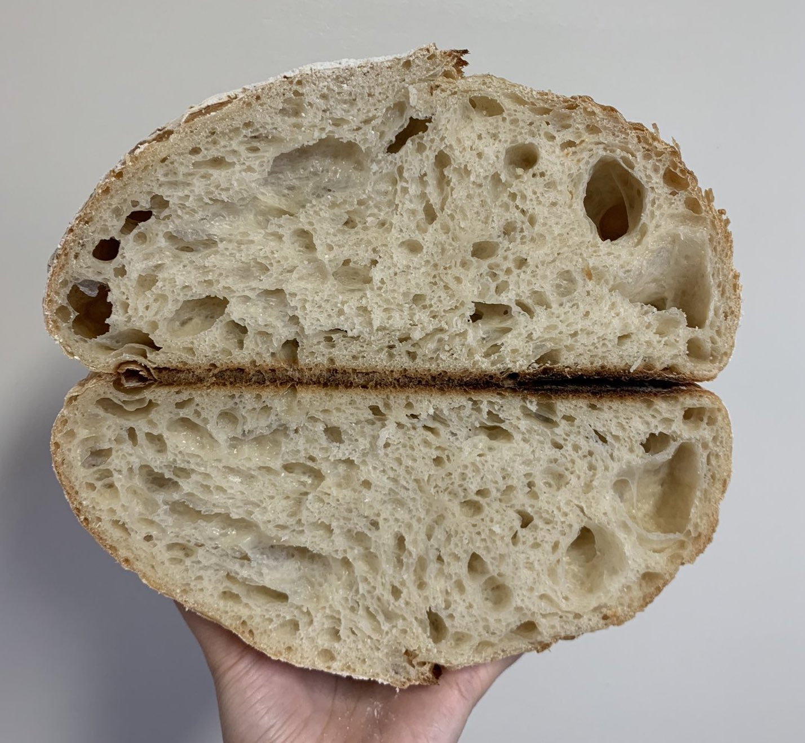
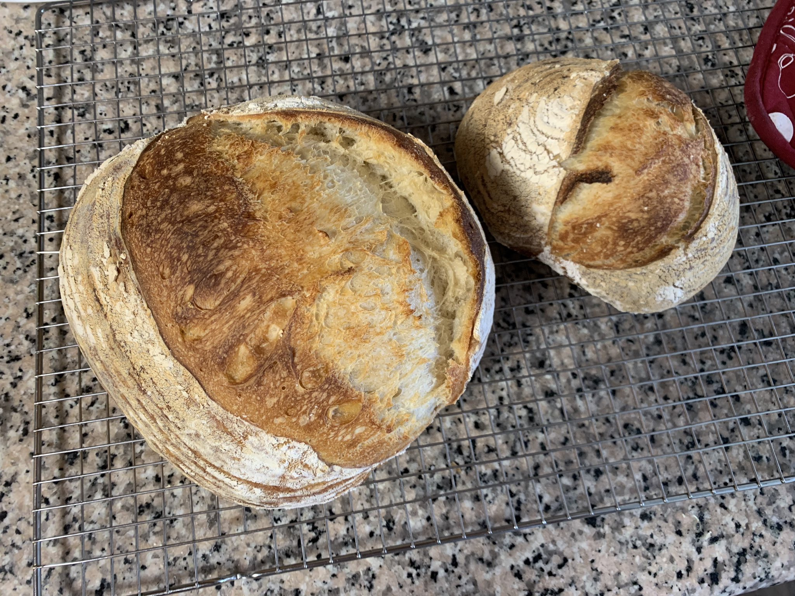
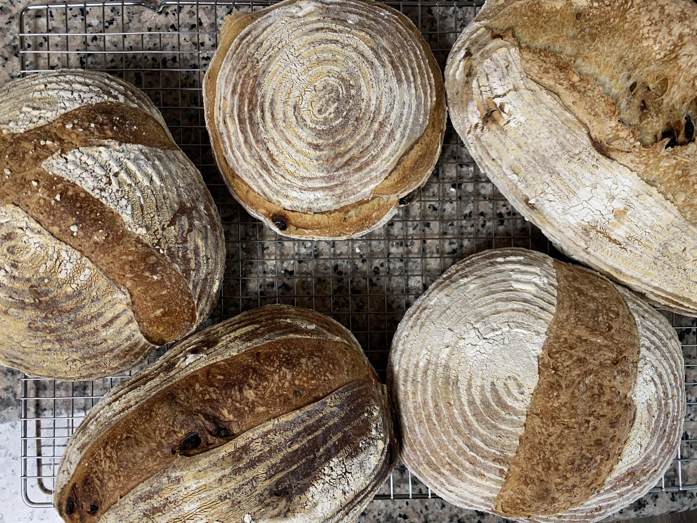
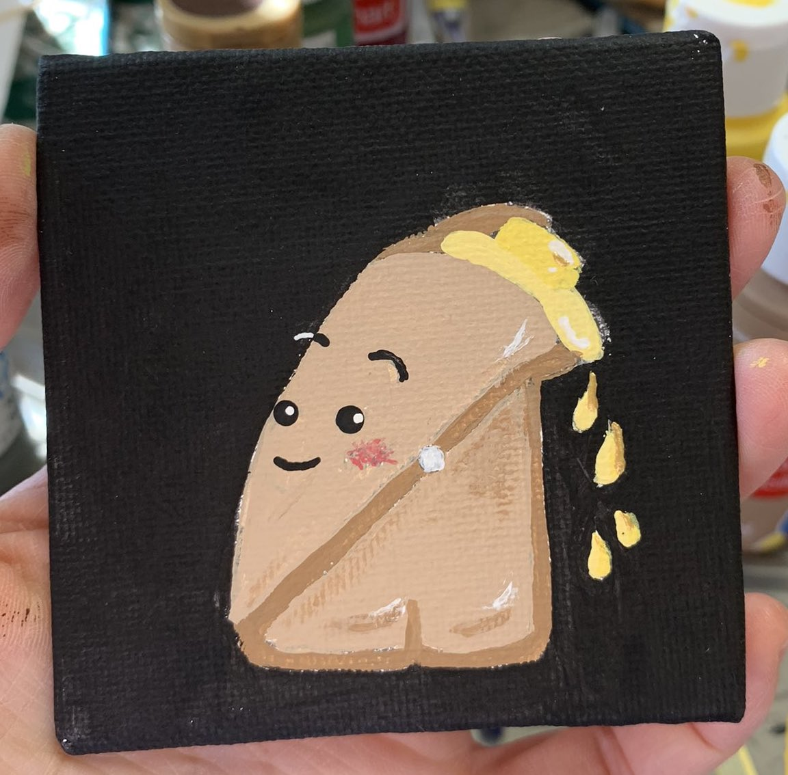
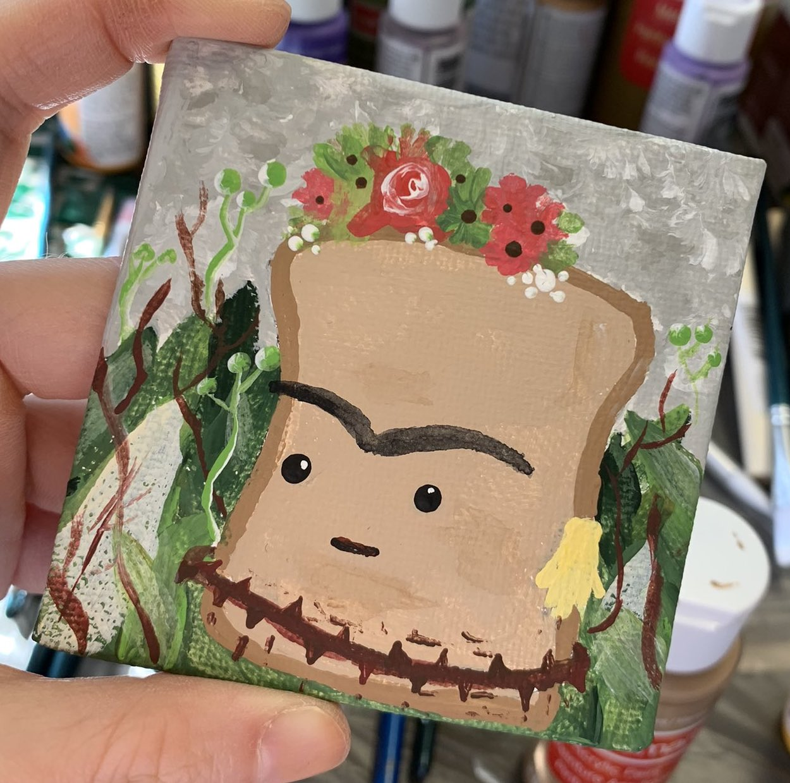
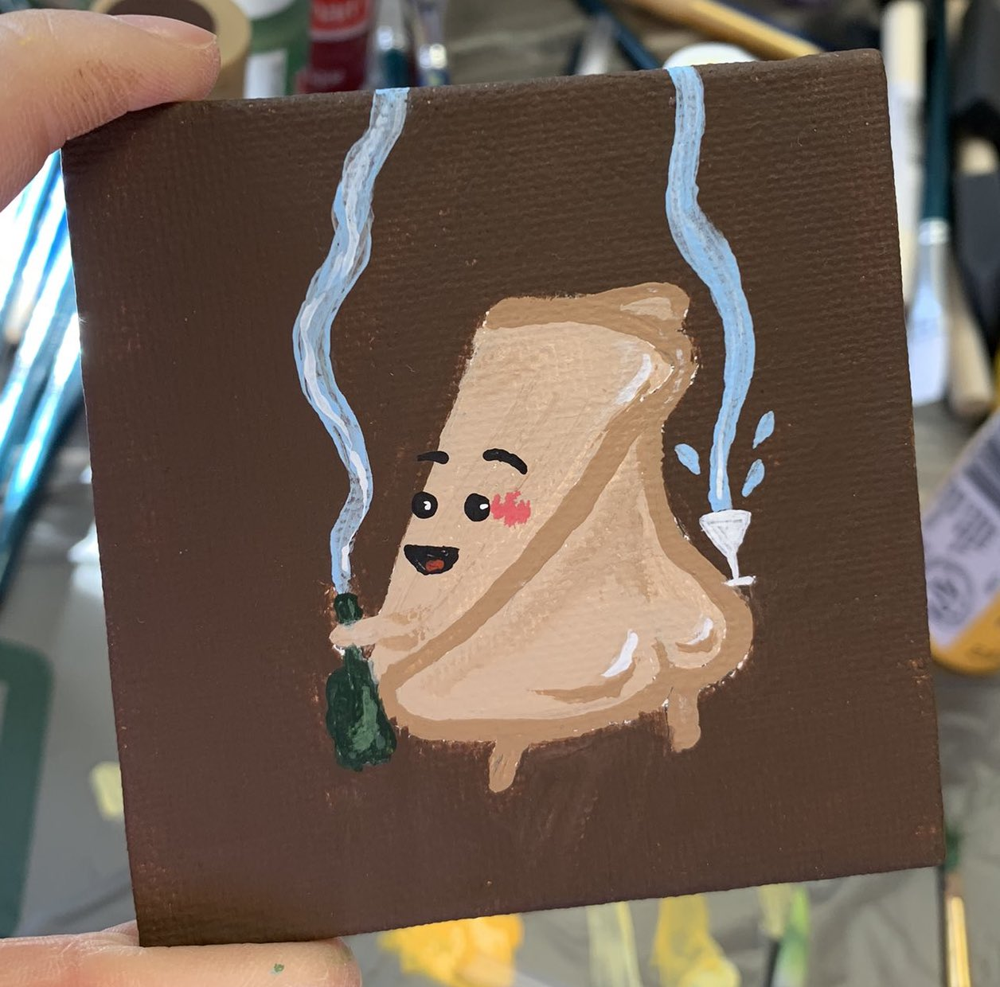
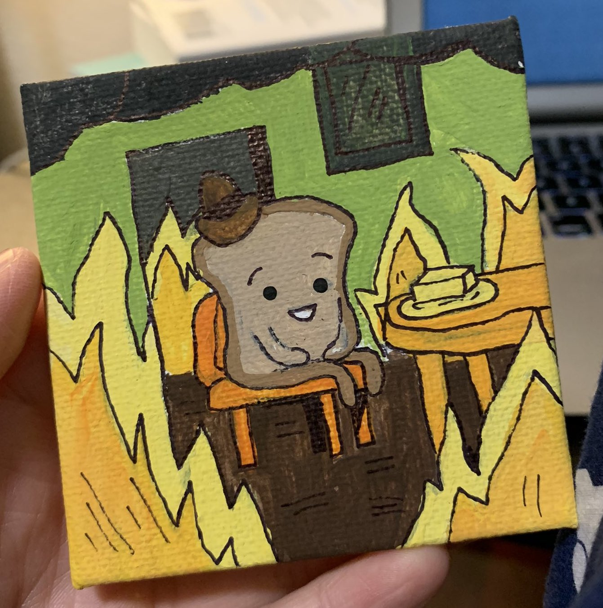

Given the state of the world in 2020, I’m grateful to have had the opportunity and capacity to work toward my goals. Here’s a reflection of some of the things I did this year and some things I want to do next year.

## I wrote 24 blogs

I started blogging in late 2019 as a way to document and share learnings from my journey into software engineering. In early 2020, I then dabbled in writing a few code tutorials and discovered I really enjoy writing technical blogs. 

Here I am now, with quite a few blogs under my belt this year:
- [Best Practices for Building a Product Landing Page](https://sophiali.dev/Best-Practices-for-Building-a-Product-Landing-Page)
- [5 Things I Learned From Coding with Other People: My First Web Development Team Project](https://sophiali.dev/5-Things-I-Learned-From-Coding-with-Other-People)
- [4-Step Strategy to Frame Your Thought Process in a Whiteboard Coding Interview](https://sophiali.dev/4-Step-Whiteboarding-Strategy)
- [Top 10 Tips for Self-taught Software Engineers from 20+ Coffee Chats](https://sophiali.dev/top-10-tips-for-self-taught-software-engineers) 
- [How On Earth Do You Use NASA APIs with Azure Functions?](https://sophiali.dev/nasa-api-azure-functions)
- [So You Forgot to Feed Your Sourdough Starter Baby?](https://sophiali.dev/sourdough-baby)
- [How to Deploy a React App and Node.js/Express Backend API to Heroku From a Monorepo](https://sophiali.dev/how-to-deploy-monorepo-to-heroku)
- [How to Use the JavaScript Fetch API to Get Data from the NASA APOD API](https://sophiali.dev/javascript-fetch-api-with-nasa-api)
- [Modern JavaScript: ES6 and Beyond](https://sophiali.dev/modern-javascript-es6)
- [JavaScript: var, let, const](https://sophiali.dev/javascript-var-let-const)
- [Remembering slice vs splice in JavaScript](https://sophiali.dev/javascript-slice-splice)
- [Looping in JavaScript](https://sophiali.dev/javascript-looping)
- [Understanding undeclared, undefined, and null in JavaScript](https://sophiali.dev/javascript-undeclared-undefined-null)
- [Understanding Arrays in JavaScript](https://sophiali.dev/javascript-arrays)
- [How to Use JavaScript Array Methods](https://sophiali.dev/javascript-array-methods)
- [How to Copy an Email Address on Click in React](https://sophiali.dev/copy-email-address-on-click-react)
- [Learnings from my 1st Live Pairing Session & 1st Pull Request to Forem](https://sophiali.dev/first-forem-open-source-pull-request)
- [Examples of Syntactic Sugar in JavaScript](https://sophiali.dev/syntactic-sugar-examples-javascript)
- [Developer Blogs I Follow](https://sophiali.dev/developer-blogs)
- [Understanding Objects in JavaScript](https://sophiali.dev/javascript-objects)
- [Understanding the Type System, Type Annotations, Type Inference, and Interfaces in TypeScript](https://sophiali.dev/understanding-typescript)
- [What is a Magic Number in Programming?](https://sophiali.dev/magic-number-programming)
- [My Ergonomic Work From Home Office Setup](https://sophiali.dev/home-office-ergonomic-setup) 

## I created and completed an open source software engineering learning guide
My primary goal in 2020 was to learn how to code and land my first software engineering role. To do this, I set Objectives and Key Results (OKRs) as a systematic and metric driven way to create an iterative learning plan for myself. 

Because of the positive feedback I got from a lot of friends and mentors, I decided to make [my OKRs public](https://docs.google.com/spreadsheets/d/1HAFmN-UvrFHBYnMRrjpgCKGGjZT1sZnnWI5YfOrw0uo/edit#gid=0) and shared my [learning resources in a GitHub repo](https://github.com/sophi-li/OKRs-self-learning). The goal of making my learning plan public was to pay it forward and share my journey with anyone who might be thinking about going down a similar path. To my surprise, I’ve gotten about 300 stars on the repo and dozens of emails from people who have told me they found the guide useful and adapted it for themselves. 

As part of my OKRs, I invested a lot of time in:
- Learning HTML, CSS, JavaScript, Node, and React
- Working on projects to learn and practice new code concepts
- Writing code tutorials and blogs
- Remote pair programming sessions with friends around the world
- Learning data structures and algorithms on [Interview Cake](https://www.interviewcake.com/) 
- Mock interviews and a lot of Leetcode problems
- Co-organizing [Write/Speak/Code](https://www.meetup.com/WriteSpeakCode-SFBay/)  meetups in San Francisco (pre-pandemic)
- Attending code related meetups (pre-pandemic) 
- A lot of [coffee chats](https://sophiali.dev/top-10-tips-for-self-taught-software-engineers)  (pre-pandemic) 
- Countless job applications and a handful of interviews
- Indoor bouldering (pre-pandemic) and baking a lot (because taking breaks is part of the process!)

## I built 3 projects I really like
- [Bread Puns API](https://github.com/sophi-li/breadpun-api) - This project was a silly one because I wanted to combine two of my favorite things, bread and puns. This was also how I learned how to build a simple API with Node and Express.
- [Sourdough Starter Reminder](https://github.com/sophi-li/sourdough-timer) -  This one was a fun one to make because it actually solves a real world problem, most relevant during the 2020 quarantine sourdough phase. I also wrote a [tutorial on this project](https://sophiali.dev/sourdough-baby) with my friend, Chloe. 
- [sophiali.dev](https://sophiali.dev/blog) - This is my blog, the site that you're on right now. I’ve written consistently this year and I’m proud of all the knowledge I’ve gained and shared through writing. 

## I landed my first software engineering job
In August 2019, I left my job to learn how to code and become a software engineer. In August 2020, I landed my first software engineering role. I am currently a software engineer at [FreeWill](https://www.freewill.com). I’m happy to be doing something I like *while also* working at a company with a mission I believe in.

## I baked a lot of bread
I baked countless loaves of sourdough bread and went through at least two 50 pound bags of flour. That's 100+ pounds of flour!

## I learned how to paint
Of course, I painted bread!

*Bread with Pearl Earring*

*Frida Kahloaf*

*Bread Kardashian*

*2020 Quarantine Sourdough Phase*

## 2021 Writing Goals
Here are a few things I want to learn more and write about:
- Understanding **MobX**
- **SQL** basics
- ORM (object-relational mapping) with **Sequelize**
- Giving good **code reviews**

## Conclusion
I accomplished my 2020 goal:
- I learned how to code and landed my first software engineering role. 

I’m looking forward to learning and writing more about the things I learn. Thank you for reading my blogs and coming along this journey with me.

Wishing you and yours a safe and happy holidays!

